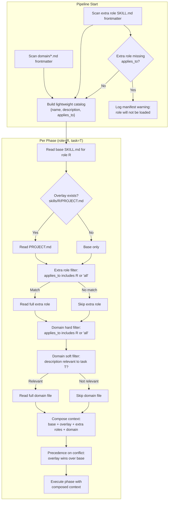
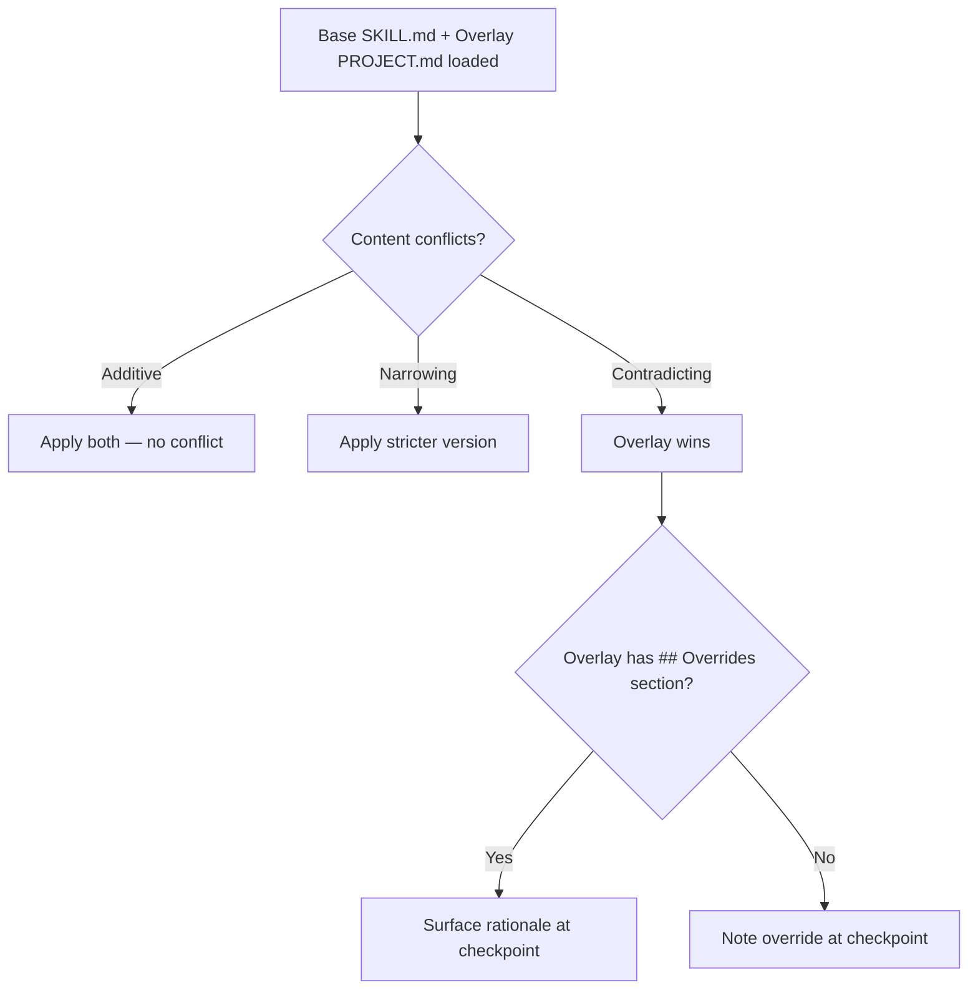

# Lifecycle Agent Orchestrator — Portable Development Lifecycle Engine

**Date:** 2026-04-04
**Status:** Approved
**Author:** Sandeep Mewara + Claude

---

## 1. Overview

### 1.1 What This Is

A portable, project-agnostic development lifecycle orchestrator that drives requirements through to pull requests using Claude Code skills. It encodes *how software gets built* — not *what* gets built — making it reusable across any project that uses Claude Code.

### 1.2 Problem Statement

Today, the development lifecycle workflow in Claude Code is manual. A developer must know which skills to invoke, in what order, with what inputs. There is no higher-level coordinator that:

- Maps a requirement or Jira story through the full lifecycle
- Enforces cross-role alignment (PM, XD, Architecture review each other's work)
- Tracks acceptance criteria from intake through validation
- Presents structured checkpoints for human review
- Produces structured outputs that a future UI could render

### 1.3 Goals

1. **Full development lifecycle coverage** — from raw requirement to merged PR, every phase has a skill
2. **Cross-role review gates** — PM, XD, and Architecture review each other's outputs at key handoffs
3. **Human-in-the-loop** — checkpoint at every phase, with combined presentation for simpler stories
4. **Preview-then-Execute** — simulate the full pipeline before making any real changes, then carry context forward into execution
5. **Portable** — the orchestrator + base skills work on any project. Project-specific rules live as overlays in the project repo
6. **UI-ready** — structured phase output contract from day one, CLI rendering now, dashboard later

### 1.4 Non-Goals

- Building a runtime agent (LangGraph, server, DB) — this is a Claude Code plugin
- Auto-classifying story complexity — the human is the classifier via combined checkpoints
- Autonomous execution without human approval — every phase gates on human input (to start)
- Replacing platform-specific execution tools — the orchestrator provides its own built-in workflows

---

## 2. Architecture

### 2.1 Plugin Structure

The orchestrator is distributed as a Claude Code marketplace containing a single plugin:

```
lifecycle-agent-orchestrator/                           # Marketplace root (Git repo)
├── .claude-plugin/
│   └── marketplace.json                     # Claude Code marketplace manifest
├── .cursor-plugin/
│   └── marketplace.json                     # Cursor marketplace manifest
├── plugins/
│   └── lifecycle-agent-orchestrator/                   # The plugin
│       ├── .claude-plugin/
│       │   └── plugin.json                  # Plugin manifest for Claude Code
│       ├── .cursor-plugin/
│       │   └── plugin.json                  # Plugin manifest for Cursor
│       ├── skills/                          # All 13 skills (shared by both platforms)
│       │   ├── lao/           # Command: full pipeline
│       │   ├── lao-dry-run/   # Command: simulation
│       │   ├── lao-setup/     # Command: project setup
│       │   ├── product-management/          # Role: PRD and Jira ticket creation
│       │   ├── intake/                      # Role: scope extraction
│       │   ├── experience-design/           # Role: UX research, design, specs
│       │   ├── architecture/                # Role: system design, ADRs, review
│       │   ├── coding-standards/            # Role: coding conventions
│       │   ├── testing-conventions/         # Role: test patterns and standards
│       │   ├── code-review/                # Role: PR and code review
│       │   ├── security/                    # Role: security review and threat analysis
│       │   ├── acceptance-validation/       # Role: AC verification gate
│       │   └── shipping/                    # Role: PR creation, Jira updates
│       ├── contracts/
│       │   └── phase-output-schema.md       # Structured output contract
│       ├── docs/
│       │   └── 2026-04-04-lifecycle-agent-orchestrator-design-spec.md  # Design spec + ADRs
│       ├── examples/
│       │   ├── lao.config.yaml             # Annotated config file template
│       │   ├── reference-walkthrough.md     # End-to-end example scenarios
│       │   └── sample-requirement.md        # Bundled sample for dry-run
│       ├── scripts/
│       │   ├── check-consistency.sh         # Cross-reference consistency checks
│       │   ├── validate-plugin.sh           # Plugin structural validation (61 checks)
│       │   └── validate-project-skills.sh   # Project skills validation (convention/config/scan)
│       └── tests/
│           ├── validate-plugin.bats         # Plugin validation tests
│           ├── validate-project-skills.bats # Project skills validation tests
│           └── fixtures/                    # Test data for bats tests
└── README.md                                # Usage guide and documentation
```

### 2.2 Base + Overlay + Domain Layering

Each phase composes up to three layers of knowledge:

| Layer | Location | Contains | Portable? |
|---|---|---|---|
| **Base** | `plugins/lifecycle-agent-orchestrator/skills/<role>/SKILL.md` | Universal rules applicable to any project | Yes |
| **Overlay** | `<project>/skills/<role>/PROJECT.md` | Project-specific additions (patterns, tools, conventions) | No |
| **Domain** | `<project>/skills/domain/<topic>.md` | Cross-cutting domain knowledge shared across phases | No |

Projects may also define **extra roles** beyond the base skills using standalone `SKILL.md` files at `<project>/skills/<role-name>/SKILL.md`. Extra roles include `applies_to` frontmatter to declare which phases they are relevant to (see Section 10.4).

When the orchestrator invokes a skill for a given role, it reads the base SKILL.md and the project's PROJECT.md (if it exists), plus any relevant domain files. If no overlay exists, the base skill operates standalone.

**Precedence:** On conflict, the overlay wins — the project is the domain authority. The base provides sensible defaults that yield to project-specific reality. Overlays SHOULD include an `## Overrides` section when contradicting a base rule, but the project's domain knowledge takes precedence regardless.

**Skill discovery — two methods:**

Projects connect skills to the orchestrator via either:

1. **Config file** (primary) — `<project-root>/lao.config.yaml` with explicit path mappings to overlay, domain, and extra role files. Best for existing projects with established directory structures. When present, the convention scan is skipped entirely.
2. **Convention** (fallback) — `<project-root>/skills/` directory structure. Zero-config for new projects.

See ADR-007 for rationale on this dual approach.

**Convention overlay path:**

```
<project-root>/skills/<role>/PROJECT.md
```

Where `<role>` matches the directory name in `skills/` (e.g., `architecture`, `coding-standards`, `code-review`).

**Domain context convention:**

```
<project-root>/skills/domain/<topic>.md
```

Each domain file has YAML frontmatter with `name`, `description`, and optional `applies_to` (defaults to `all`). The orchestrator uses two-tier loading:

1. **Index tier** — at pipeline start, reads only frontmatter from every `domain/*.md` file. Builds a lightweight `{name, description, applies_to}` catalog that persists for the run.
2. **Load tier** — at each phase, hard-filters by `applies_to`, then checks the `description` for relevance to the current task. Only files that pass both checks are loaded in full.

#### Skill Composition Flow

The following diagram shows how the orchestrator assembles context for each phase at runtime — from pipeline-level domain indexing through per-phase skill composition:



#### Overlay Precedence Detail

When both base and overlay provide guidance on the same topic:



**Example A: Convention-based** — a project called `my-app`:
```
my-app/
└── skills/
    ├── architecture/PROJECT.md       # Overlay: project-specific stack, patterns
    ├── coding-standards/PROJECT.md   # Overlay: project-specific conventions
    ├── testing-conventions/PROJECT.md # Overlay: project-specific test infra
    ├── code-review/PROJECT.md        # Overlay: project-specific review checks
    ├── shipping/PROJECT.md           # Overlay: project-specific CI/CD
    ├── compliance-review/SKILL.md    # Extra role: applies_to in frontmatter
    └── domain/                       # Cross-cutting domain context
        ├── auth-system.md            # Domain: auth patterns (all phases)
        └── payment-processing.md     # Domain: PCI constraints (scoped)
```

**Example B: Config-based** — the same project using `lao.config.yaml`:
```yaml
# my-app/lao.config.yaml
project_name: my-app
overlays:
  architecture: docs/architecture/standards.md
  coding-standards: .cursor/rules/coding.md
domain:
  - docs/domain/*.md
  - src/payments/DESIGN.md
extra_roles:
  compliance-review: tools/compliance/SKILL.md
```

Both approaches produce the same manifest at pipeline start — the orchestrator resolves paths regardless of source.

### 2.3 Built-in Phase Workflows

Phases 6-9 use standalone workflows built into the plugin, defined in
`skills/lao/references/phase-workflows.md`. No external plugins are required.

| Phase | Built-in Workflow | Key Disciplines |
|---|---|---|
| 6. Plan | TDD task decomposition | No-placeholder rule, self-review checklist, bite-sized steps with exact code |
| 7. Implement | TDD + two-stage review | Red-green-refactor, spec compliance review, code quality review, systematic debugging |
| 8. Validate | Evidence-based verification | Verification gate (identify → run → read → confirm), rationalization prevention |
| 9. Ship | Structured completion | Pre-ship test verification, 4 completion options (PR, merge, keep, discard) |

The orchestrator adds cross-role review gates, acceptance criteria tracking,
structured phase outputs, preview-then-execute model, and the PM/intake/XD phases
on top of these execution workflows.

### 2.4 Design Decision: Role Skills vs. Execution Workflows

The plugin uses two kinds of phase implementations. This is a deliberate
architectural split — not an inconsistency — driven by what each group of
phases actually does. The guiding principle: **everything works out of the box,
everything is overridable.**

#### Role Skills (Phases 1-5)

Each phase embodies a persona — Product Manager, Experience Designer, Architect —
with domain judgment that varies by project context:

- A fintech project's architecture review emphasizes regulatory compliance and
  audit trails. A game studio's emphasizes frame budgets and asset pipelines.
- A B2C product's experience design focuses on conversion funnels. An internal
  tool's focuses on workflow efficiency.

These differences are handled through **project overlays** — markdown files that
extend or override the base skill's rules per project. Each phase is a standalone
skill with its own directory, frontmatter, and overlay support.

#### Execution Workflows (Phases 6-9)

Phases 6-9 are mechanical processes — the orchestrator's own execution engine:

- **Plan:** Decompose a design into bite-sized TDD tasks with exact code
- **Implement:** Run the red-green-refactor TDD cycle with two-stage review
- **Validate:** Verify every acceptance criterion with fresh evidence
- **Ship:** Run pre-ship checks, present completion options, create PR

These are tightly coupled — plan structure dictates implement structure, implement
results feed validate checks, validate status determines ship readiness. They live
as a single workflow document (`phase-workflows.md`) inside the orchestrator
because they're steps in the orchestrator's own process, not independent actors.

#### Why Workflows Instead of Separate Skills?

1. **Tight coupling.** The plan → implement → validate → ship sequence shares
   state and structure. A single document preserves this continuity instead of
   fragmenting it across isolated skill invocations.

2. **Orchestrator-owned.** Phases 1-5 invoke external actors — "be the PM and
   produce a PRD." Phases 6-9 are the orchestrator executing — "here's how I
   carry out the plan you approved." They're engine steps, not role personas.

3. **Hybrid composition.** Phases 8-9 compose a base role skill (acceptance-validation,
   shipping) with the workflow's execution discipline. The base skill handles
   domain-specific content (validation report format, PR template) and supports
   overlays. The workflow handles universal execution discipline (verify evidence
   before claiming, run tests before shipping).

#### Override Mechanism

The built-in workflows handle the common case, but projects can replace any
phase's workflow via `lao.config.yaml`:

```yaml
workflows:
  implement: docs/workflows/our-bdd-process.md   # BDD instead of TDD
  ship: docs/workflows/our-release-process.md     # custom release flow
```

Key design choices for workflow overrides:

- **Replace, not layer.** A workflow override replaces the built-in workflow for
  that phase entirely. Methodology changes are substitutions (TDD → BDD), not
  additive layers. This differs from role skill overlays, which merge with the
  base skill.
- **Per-phase granularity.** Override only the phases you need. Omitted phases
  use the built-in default.
- **Valid keys:** `plan`, `implement`, `validate`, `ship`.

This gives every phase a customization path:

| Phase | Customization Mechanism |
|---|---|
| 1-5 | Role skill overlays (additive, merged with base) |
| 6-7 | Workflow overrides (replacement) |
| 8-9 | Both: role skill overlays for domain content + workflow overrides for execution discipline |

#### The Composition Model

The result is a two-layer architecture where nothing is locked down:

```
Phases 1-5: Orchestrator invokes role skills
             → customized via overlays, domain context, extra roles

Phases 6-9: Orchestrator executes workflows
             → customized via workflow overrides in lao.config.yaml
             → Phases 8-9 also compose base skills (with their own overlays)
```

---

## 3. Preview-Then-Execute Model

The orchestrator always runs in two phases: **Preview** then **Execute**.

### 3.1 Preview Phase (no real changes)

Run through all applicable lifecycle phases in simulation mode:
- NO file creation or modification
- NO git operations (no branches, commits, or pushes)
- NO Jira operations (no ticket creation, transitions, or comments)
- NO PR creation

At each phase, produce realistic PhaseOutput showing what *would* happen. Present checkpoints for human review. The user can:
- Approve and continue to the next phase preview
- Request changes to scope, design direction, plan approach
- Adjust overlays or skill configurations if a phase output doesn't look right
- Iterate until satisfied — nothing real has happened yet

The preview covers Phases 1-6 (PM through Plan). Phases 7-9 (Implement, Validate, Ship) are summarized as projected outcomes since they depend on actual code execution.

### 3.2 Transition Gate

After the preview completes:

```
=== Preview Complete ===

Phases previewed: {N}
Acceptance criteria: {N} identified
Design approach: {summary}
Implementation plan: {N} tasks
Projected outcome: {summary}

→ "Proceed with implementation" — start real execution
→ "Adjust [phase]" — revisit a specific phase in preview mode
→ "Abort" — stop here, nothing was changed
```

### 3.3 Execute Phase (real changes)

On "proceed with implementation", re-run the pipeline with real changes:
- **Context carried forward** — scope, ACs, design decisions, cross-review outcomes, and plan from preview are reused. Not regenerated.
- **Human checkpoints still active** — every phase still gates on human approval.
- **All phases run for real** — Phases 1-6 execute using preview decisions. Phases 7-9 run fresh (actual code execution).

### 3.4 Benefits

- Iterate on scope and design with zero risk (nothing real happens during preview)
- Catch misalignment before any code is written
- Same token cost — preview thinking carries into execution, not duplicated
- Human stays in control during both preview and execution

---

## 4. Lifecycle Phases

### 4.1 Phase Overview

```
PHASE 1: Product Management
  → PRD + Jira tickets
  → Cross-review: XD (UX feasibility) + Architecture (tech feasibility)
  → HUMAN CHECKPOINT

PHASE 2: Experience Design — PRD Level (conditional — UX PRDs only)
  → Complete experience design: journeys, screens, interactions, states
  → Cross-review: PM (requirements coverage) + Architecture (tech feasibility)
  → HUMAN CHECKPOINT

PHASE 3: Architecture — System Design
  → System components, diagrams, ADRs, dependency graph, ticket ordering
  → Cross-review: PM (AC coverage) + XD (design support, if Phase 2 ran)
  → HUMAN CHECKPOINT

[Per Jira ticket, in architect-determined order:]

  PHASE 4: Intake
    → Scope summary + acceptance criteria
    → Output only (no checkpoint when combined)

  PHASE 5: Tech Design
    → Low-level technical design (API contracts, data models, class design)
    → No cross-review — purely technical, within Phase 3 system architecture
    → HUMAN CHECKPOINT

  PHASE 6: Plan
    → Task-level implementation plan
    → HUMAN CHECKPOINT

  PHASE 7: Implement
    → Code committed, tests passing
    → Per-task: Implementer → Spec review → Code quality review
    → HUMAN CHECKPOINT

  PHASE 8: Validate
    → Acceptance criteria verified, full test suite passing
    → HUMAN CHECKPOINT

  PHASE 9: Ship
    → PR created, Jira updated
    → HUMAN CHECKPOINT
```

All cross-reviews happen in Phases 1-3 before any per-ticket work starts.
Phase 2 is conditional — skipped for backend-only requirements.

### 4.2 Phase Details

#### Phase 1: Product Management

**Skill:** `product-management` (base + overlay)
**Input:** Raw requirement, idea, bug report, or feature description.

**Process:**
1. Analyze the input — understand what is being asked
2. Produce a PRD with: problem statement, user stories, acceptance criteria, scope boundaries, success metrics
3. Create Jira ticket(s) — simple requirement → single ticket; complex → PRD + multiple tickets

**Cross-review gate:**
- XD reviews PRD for UX feasibility and completeness
- Architecture reviews PRD for technical feasibility
- PM reconciles feedback, updates PRD

**Human checkpoint:** Approve PRD + created tickets.

**Output:**
```
PhaseOutput:
  phase_name: "product_management"
  summary: "PRD created with 3 user stories, 2 Jira tickets"
  artifacts: [prd_document, jira_ticket_links]
  cross_reviews: [xd_feedback, architecture_feedback, reconciliation]
  approval_needed: true
```

#### Phase 2: Experience Design — PRD Level (Conditional)

**Skill:** `experience-design` (base + overlay)
**Trigger:** Only invoked when the PRD involves user-facing changes (`ux_needed: true`
from the Phase 1 XD cross-review). Skipped for backend-only requirements.
**Input:** Approved PRD + Jira tickets from Phase 1.

**Process:**
1. Produce complete experience design across all tickets in the PRD
2. Deliverables: user journey maps, screen inventory, interaction specs,
   error/empty/loading states — enough for architecture and implementation
   to proceed without blocking on design refinements
3. Attach design artifacts to the PRD / Jira epic

**Cross-review gate:**
- PM reviews against requirements coverage
- Architecture reviews for technical feasibility
- XD reconciles feedback

**Human checkpoint:** Approve experience design.

**Output:**
```
PhaseOutput:
  phase_name: "experience_design"
  summary: "Complete experience design: 4 screens, 2 user journeys, interaction specs"
  artifacts: [journey_maps, screen_inventory, interaction_specs, state_inventory]
  cross_reviews: [pm_feedback, architecture_feedback, reconciliation]
  approval_needed: true
```

#### Phase 3: Architecture — System Design

**Skill:** `architecture` (base + overlay)
**Input:** Approved PRD + Jira tickets + XD design artifacts (if Phase 2 ran).

**Process:**
1. Produce system-level design across all tickets — components, boundaries, key decisions
2. Generate system diagrams (component diagram, high-level sequence diagrams)
3. Record key architectural decisions as ADRs
4. Identify dependencies between tickets based on the system design
5. Determine execution order (sequential vs. parallel)
6. Scale to complexity: simple PRD = component overview + ordering,
   complex PRD = full system design document with diagrams and ADRs

**Cross-review gate:**
- PM reviews for acceptance criteria coverage
- XD reviews for design support (if Phase 2 ran)
- Architecture reconciles feedback

**Note:** This phase produces the system-level blueprint — components, boundaries,
dependencies, and key decisions. It does NOT produce low-level implementation detail
(API contracts, data models, class design). Those belong in Phase 5 (per-ticket).

**Human checkpoint:** Approve system design + ticket ordering.

**Output:**
```
PhaseOutput:
  phase_name: "architecture_system_design"
  summary: "System design: 3 components, 2 ADRs. PROJ-101 first (foundation), PROJ-102 + PROJ-103 parallel"
  artifacts: [system_design_doc, component_diagram, adrs, dependency_graph, ordered_sequence]
  cross_reviews: [pm_feedback, xd_feedback, reconciliation]
  approval_needed: true
```

#### Phase 4: Intake

**Skill:** `intake` (base + overlay)
**Input:** A single Jira ticket.

**Process:**
1. Read the Jira story (via Jira MCP or user-provided description)
2. Extract: title, description, acceptance criteria, design links, labels, priority
3. Produce structured scope summary referencing the system design from Phase 3
   and XD artifacts from Phase 2 (if applicable)

**Human checkpoint:** Part of combined checkpoint (see Section 5).

**Output:**
```
PhaseOutput:
  phase_name: "intake"
  summary: "PROJ-101: Add notification preferences API. 3 acceptance criteria."
  artifacts: [scope_summary]
  acceptance_criteria: ["AC1: ...", "AC2: ...", "AC3: ..."]
  approval_needed: false  # Combined with later phases
```

#### Phase 5: Tech Design

**Skill:** `architecture` (base + overlay) — same skill as Phase 3, but at ticket level
**Input:** Jira ticket + scope summary + system design from Phase 3 + XD artifacts (if any).

**Process:**
1. Produce low-level technical design within the system architecture from Phase 3
2. Detail: API contracts, data models, class/module design, query patterns
3. Scale to complexity: simple = 2-3 sentences, complex = full design doc

**No cross-review** — all alignment happened in Phases 1-3. This is purely technical.

**Human checkpoint:** Approve tech design.

#### Phase 6: Plan

**Workflow:** Built-in (`phase-workflows.md`)
**Input:** Approved tech design from Phase 5.

**Process:**
1. Map affected files with clear responsibilities
2. Break the design into TDD tasks (2-10 min each) with exact code, file paths, and commands
3. No placeholders — every step has actual code/commands
4. Self-review: verify spec coverage, scan for placeholders, check type consistency

**Human checkpoint:** Approve plan.

#### Phase 7: Implement

**Workflow:** Built-in (`phase-workflows.md`)
**Input:** Approved plan from Phase 6.

**Process:**
1. Create feature branch from base branch
2. Per task: strict TDD (red → verify fail → green → verify pass → refactor → commit)
3. Per task: two-stage review (spec compliance → code quality) with fix loops
4. Systematic debugging protocol when issues arise (root cause → hypothesis → fix)
5. Run full suite after all tasks

**Human checkpoint:** Approve implementation.

#### Phase 8: Validate

**Skill:** `acceptance-validation` (base + overlay)
**Workflow:** Built-in verification discipline (`phase-workflows.md`)
**Input:** Acceptance criteria from Phase 4 + implemented code from Phase 7.

**Process:**
1. For each AC: identify verification method, execute, record pass/fail with evidence
2. Run full test suite
3. Run project-specific validation scripts (if any)
4. Verification gate: no claims without fresh evidence
5. Produce acceptance report

**Human checkpoint:** Approve validation results.

#### Phase 9: Ship

**Skill:** `shipping` (base + overlay)
**Workflow:** Built-in completion workflow (`phase-workflows.md`)
**Input:** Validated code from Phase 8.

**Process:**
1. Pre-ship checks (uncommitted changes, branch name, test status)
2. Present completion options (PR, merge, keep, discard)
3. Create PR with structured description including acceptance criteria status
4. Update Jira ticket (transition status, add PR link comment)

**Human checkpoint:** Approve PR.

---

## 5. Checkpoint Collapsing

The orchestrator always runs all applicable phases internally. Collapsing is a **presentation** optimization — phases are grouped into combined checkpoints to reduce human interruptions for straightforward work.

### 5.1 Collapsing Rules

| Scenario | Entry Point | Phases Run | Combined Checkpoints |
|---|---|---|---|
| **Complex requirement, UX** | Raw requirement/idea | All 9 | Phase 1, Phase 2 (XD), Phase 3 (system design + ordering), then per ticket: 4+5, 6, 7+8, 9 |
| **Complex requirement, backend** | Raw requirement/idea | 1, 3, then per ticket 4-9 | Phase 1, Phase 3 (system design + ordering), then per ticket: 4+5, 6, 7+8, 9 |
| **Single Jira, UX** | Jira ticket | 2, 3, 4, 5, 6, 7, 8, 9 | Checkpoint 1 (XD), Checkpoint 2 (system design), Checkpoint 3 (scope + tech design + plan), Checkpoint 4 (implement + validate), Checkpoint 5 (ship) |
| **Single Jira, backend** | Jira ticket | 4, 5, 6, 7, 8, 9 | Checkpoint 1 (scope + design + plan), Checkpoint 2 (implement + validate), Checkpoint 3 (ship) |
| **Jira + existing design** | Jira ticket + design doc | 4, 6, 7, 8, 9 | Checkpoint 1 (scope + plan), Checkpoint 2 (implement + validate + ship) |

### 5.2 Expanding a Combined Checkpoint

At any combined checkpoint, the human can request expansion:

- **"Show me the tech design separately"** — orchestrator breaks out Phase 5 output
- **"I want to review the plan before implementation"** — orchestrator adds a gate between Phase 6 and Phase 7
- **"Run XD even though this looks backend-only"** — orchestrator invokes Phase 2

---

## 6. Cross-Role Review Gates

### 6.1 Review Matrix

All cross-reviews happen in Phases 1-3, before any per-ticket work starts:

| Phase Output | Reviewed By | Review Focus |
|---|---|---|
| PRD (Phase 1) | XD + Architecture | UX feasibility, tech feasibility |
| XD Design (Phase 2) | PM + Architecture | Requirements coverage, tech feasibility |
| System Design (Phase 3) | PM + XD (if Phase 2 ran) | AC coverage, design support |

Per-ticket phases (4-9) have no cross-review gates — all alignment is completed up front.

### 6.2 Review Process

1. The producing skill generates its output
2. Each reviewing skill reads the output through its own lens and produces feedback:
   - **Approved** — no concerns
   - **Approved with notes** — minor items, not blocking
   - **Changes requested** — specific items that must be addressed
3. The producing skill reconciles feedback and updates the output
4. If changes were requested, the updated output goes through review again
5. Once all reviewers approve (or approve with notes), the human checkpoint is presented

### 6.3 Reconciliation

When reviewers disagree or request conflicting changes, the producing skill:
1. Presents both perspectives to the human
2. Explains the trade-off
3. Human decides

The orchestrator does not auto-resolve conflicts between roles.

### 6.4 Review Loop Bound

Maximum **2 revision rounds** per cross-review gate. If unresolved after 2 rounds, the orchestrator escalates to the human with the current output and unresolved feedback.

---

## 7. Structured Phase Output Contract

Every phase produces a `PhaseOutput` — a structured object that the CLI renders as text and a future UI would render visually.

### 7.1 Schema

```
PhaseOutput:
  phase_name: str                    # "product_management", "intake", "tech_design", etc.
  status: str                        # "completed", "needs_approval", "blocked", "skipped"
  summary: str                       # Human-readable, 1-3 lines
  artifacts: list[Artifact]          # Files, links, documents produced
  acceptance_criteria: list[AC]      # Tracked from intake through validation
  cross_reviews: list[Review]        # Feedback from reviewing roles
  task_results: list[TaskResult]     # Per-task breakdown (phase 7)
  approval_needed: bool              # Whether this phase gates on human input
  next_phase: str                    # What comes next in the pipeline
  metadata: dict                     # Phase-specific extras

Artifact:
  type: str                          # "file", "jira_ticket", "pr", "design_doc", "plan"
  path_or_url: str
  description: str

AC:
  id: str                            # "AC1", "AC2", etc.
  text: str
  status: str                        # "pending", "pass", "fail"
  evidence: str                      # Populated in Phase 8

Review:
  reviewer_role: str                 # "pm", "xd", "architecture"
  verdict: str                       # "approved", "approved_with_notes", "changes_requested"
  feedback: str

TaskResult:
  task_id: str
  description: str
  status: str                        # "completed", "failed", "skipped"
  spec_review: str                   # "passed", "failed_then_fixed"
  quality_review: str                # "passed", "failed_then_fixed"
  files_changed: list[str]
```

### 7.2 CLI Rendering

```
--- Phase: Tech Design (Phase 5 of 9) ---
Status: Needs Approval

SUMMARY:
  Add rate limiting middleware to API gateway.
  No new dependencies, config-driven thresholds.
  Within system architecture from Phase 3.

ARTIFACTS:
  - [design_doc] docs/design/rate-limiting.md

ACCEPTANCE CRITERIA (tracked):
  AC1: Rate limit of 100 req/min per user .............. pending
  AC2: Returns 429 with retry-after header ............. pending
  AC3: Configurable per environment .................... pending

→ Approve to proceed to Plan, or request changes.
```

### 7.3 Future UI Contract

A UI dashboard would consume PhaseOutput to render:
- Pipeline view with phase status indicators (completed/active/pending/skipped)
- Expandable phase details with summary, artifacts, cross-reviews
- Acceptance criteria tracker across the pipeline lifecycle
- Approve / Request Changes buttons per checkpoint
- The UI is purely a rendering layer — same PhaseOutput objects, no separate API

---

## 8. Entry Points

The orchestrator supports four entry points, detected automatically:

### 8.1 Raw Requirement / Idea

**User says:** "I need a feature that does X" or "Here's a requirement: ..."

**Flow:** Phase 1 (PM) → Phase 2 (XD, if UX) → Phase 3 (Architecture system design) → Per-ticket: Phases 4-9

### 8.2 Existing Jira Ticket

**User says:** "Work on PROJ-1234" or "Here's the Jira ticket: ..."

**Flow:** Phase 4 (Intake) → Phases 5-9 (skipping 1, 2, and 3)

For a single UX ticket without prior design, the orchestrator may trigger Phase 2 (XD) and Phase 3 (Architecture) before proceeding.

### 8.3 Existing PRD with Tickets

**User says:** "Here's the PRD and tickets are already created: ..."

**Flow:** Phase 2 (XD, if UX) → Phase 3 (Architecture system design) → Per-ticket: Phases 4-9 (skipping Phase 1)

### 8.4 Browse Base Skills

**User says:** "Show me the architecture skill", "What does coding-standards cover?", "List the base roles"

**Flow:** No pipeline execution. The orchestrator lists all 10 role skills with descriptions, presents the requested base SKILL.md content, and offers to start the pipeline or browse another role. Supports fuzzy matching on role names.

---

## 9. Skill Inventory

### 9.1 Plugin Skills (13 total)

Skills are divided into **commands** (user-invoked entry points) and **roles**
(orchestrator-managed, invoked automatically at the appropriate phase).

| Skill | Type | Purpose | Phase |
|---|---|---|---|
| **lao** | Command | Coordinates phases, manages checkpoints, composes skills | All |
| **lao-dry-run** | Command | Standalone simulation for demos and validation | All (simulated) |
| **lao-setup** | Command | Interactive project setup — scan, configure, validate | Pre-pipeline |
| **product-management** | Role | PRD creation and Jira ticket generation | 1, cross-reviews |
| **intake** | Role | Jira story reader, scope extractor, AC derivation | 4 (per-ticket) |
| **experience-design** | Role | UX research, design options, specifications | 2 (PRD-level), cross-reviews |
| **architecture** | Role | System design, ADRs, review (system-level and ticket-level) | 3 (system), 5 (per-ticket), cross-reviews |
| **coding-standards** | Role | Coding conventions and standards enforcement (Python, Java, C#, React/TS) | 7 (via overlay) |
| **testing-conventions** | Role | Test patterns, quality, coverage standards (Python, Java, C#, React/TS) | 7 (via overlay) |
| **code-review** | Role | PR and code review with severity classification (language-aware) | 7 |
| **security** | Role | Security standards for auth, secrets, data protection, compliance (language-aware) | 7 (via overlay) |
| **acceptance-validation** | Role | AC verification gate with evidence recording | 8 |
| **shipping** | Role | PR creation, Jira updates, ship workflow | 9 |

### 9.2 Built-in Phase Workflows

Phases 6-9 use standalone workflows defined in `skills/lao/references/phase-workflows.md`.
These workflows incorporate the key disciplines needed for production-quality execution:

| Phase | Workflow | Key Disciplines |
|---|---|---|
| 6: Plan | TDD task decomposition | No-placeholder rule, self-review checklist, exact code in every step |
| 7: Implement | TDD + two-stage review | Red-green-refactor, spec compliance review, code quality review, systematic debugging |
| 8: Validate | Evidence-based verification | Verification gate (identify → run → read → confirm), rationalization prevention |
| 9: Ship | Structured completion | Pre-ship test verification, 4 completion options (PR, merge, keep, discard) |

### 9.3 Multi-Language Support (Language Packs)

Four skills (`coding-standards`, `testing-conventions`, `code-review`, `security`) use a
**language pack** architecture to support multiple programming languages while keeping
universal principles in a shared base:

```
skills/<skill>/
  SKILL.md                          # Universal principles (language-agnostic)
  references/
    checklist.md                    # Universal checklist
    python/                         # Python language pack
      checklist.md                  # Python-specific checklist
      examples.md                   # Python code examples
      tooling-config.md             # pyproject.toml, Dockerfile, CI
    java/                           # Java language pack
      checklist.md
      examples.md
      tooling-config.md
    csharp/                         # C# language pack
      checklist.md
      examples.md
      tooling-config.md
```

**Design rationale:**

- **Universal base** captures principles that transcend language (error handling strategy,
  test pyramid design, security posture, review severity). These change rarely.
- **Language packs** capture implementation patterns (pytest vs JUnit, structlog vs SLF4J,
  Pydantic vs Bean Validation). These are specific and prescriptive.
- **Language detection** happens once at pipeline start (from `lao.config.yaml` or
  auto-detected from project files) and is recorded in the manifest. Detection
  collects **all** matches — a full-stack project with `pyproject.toml` and a
  `package.json` containing `react` auto-detects as `[python, react]`.
- **Multi-language projects** — config supports both `language: python` (single
  string, backward compatible) and `languages: [python, react]` (list). When
  multiple languages are detected, all language packs are loaded. The agent
  applies each pack to files of its language during implementation and review.
- **Extensible** — adding a new language requires only: (1) creating a
  `references/<language>/` subdirectory in each of the 4 skills with the expected
  files (checklist, examples, tooling config per skill), (2) adding detection rules
  for that language's build files, and (3) updating validation scripts. No universal
  SKILL.md or checklist changes needed — the language-agnostic base remains untouched.
  See the README "Adding a new language" section for the step-by-step procedure.

**Supported languages:** Python, Java, C#, React/TypeScript.

---

## 10. Portability Model

### 10.1 What Ships in the Plugin

- **3 command skills** — orchestrator, dry-run, setup
- **10 role skills** — universal lifecycle rules for each phase role
- **Phase output contract** — structured schema for all phase outputs
- **Phase workflows** — standalone workflows for Phases 6-9 with TDD, two-stage review, verification, and completion disciplines
- **Reference walkthrough** — end-to-end example
- **Config template** — annotated `lao.config.yaml` example
- **Validation scripts** — `validate-plugin.sh` (61 structural checks), `check-consistency.sh` (cross-reference checks), `validate-project-skills.sh` (project convention/config/scan validation)
- **Test suite** — bats tests with fixtures for plugin and project-skills validation
- **README** — installation, overlay convention, UX contract

### 10.2 What Each Project Provides

- **Overlay files** in `<project>/skills/<role>/PROJECT.md` for project-specific rules
- **Domain files** in `<project>/skills/domain/<topic>.md` for cross-cutting domain context
- **Extra role files** in `<project>/skills/<role>/SKILL.md` for project-specific roles beyond the base 10 roles (must include `applies_to` frontmatter)
- Only create files for roles and domains that need project-specific additions

### 10.3 Installation

**Claude Code:**

```bash
# Add the marketplace
/plugin marketplace add sandeep-mewara/lifecycle-orchestrator

# Install the plugin
/plugin install lifecycle-agent-orchestrator@lifecycle-agent-orchestrator

# Verify
claude plugins list
```

**Cursor:**

Cursor uses the same shared skills. Install via Cursor's plugin system:

```bash
/plugin marketplace add sandeep-mewara/lifecycle-orchestrator
/plugin install lifecycle-agent-orchestrator@lifecycle-agent-orchestrator
```

### 10.4 Project Skill Conventions

- **Overlay:** `PROJECT.md` in a directory matching a base skill role name. On conflict with the base, the overlay wins (project is the domain authority).
- **Extra role:** `SKILL.md` in a directory that does not match any base role name. Standalone project-defined skill. Must include `applies_to` frontmatter declaring which phases the role is relevant to. If `applies_to` is missing, the role is **not loaded** and a manifest warning is shown.
- **Domain context:** `domain/<topic>.md` with YAML frontmatter (`name`, `description`, `applies_to`). Loaded via two-tier index: frontmatter scanned once, full content loaded per-phase based on `applies_to` and relevance.
- Content: **only project-specific additions** — do not duplicate base content
- If no overlay exists for a role, the base skill operates standalone

### 10.5 Example: Adding Project Skills to a New Project

A team adopting the plugin for a React + Node.js project called `dashboard-app`:

```
dashboard-app/
└── skills/
    ├── architecture/PROJECT.md       # Overlay: React + Express patterns, AWS infra
    ├── coding-standards/PROJECT.md   # Overlay: TypeScript standards, ESLint config
    ├── testing-conventions/PROJECT.md # Overlay: Jest + React Testing Library patterns
    ├── code-review/PROJECT.md        # Overlay: Frontend perf checks, accessibility
    ├── shipping/PROJECT.md           # Overlay: GitHub Actions CI, Vercel deployment
    ├── accessibility-audit/SKILL.md  # Extra role: applies_to in frontmatter
    └── domain/                       # Cross-cutting domain context
        ├── design-system.md          # Domain: component library, tokens, patterns
        └── api-contracts.md          # Domain: REST conventions, versioning rules
```

The orchestrator discovers overlays, extra roles, and domain context automatically and composes them with base skills. No plugin changes needed.

---

## 11. Future Evolution

### 11.1 Autonomous Mode

As skills harden and confidence builds, introduce automatic classification:
- Simple stories: orchestrator runs with a single summary checkpoint
- Complex stories: full phase-by-phase checkpoints
- Classification based on: number of acceptance criteria, files impacted, whether new APIs/models are introduced

### 11.2 UI Dashboard

Build a web UI that renders the PhaseOutput contract:
- Pipeline view with phase status indicators
- Expandable phase details
- Acceptance criteria tracker across the pipeline
- Approve/reject buttons per checkpoint
- The structured output contract is the API — no backend changes needed

### 11.3 Multi-Project Coordination

When multiple projects use the orchestrator, shared insights emerge:
- Common overlay patterns → candidates for promotion to base skills
- Cross-project metrics (cycle time per phase, common blockers)
- Skill effectiveness tracking

---

## ADR-001: Claude Code Plugin, Not Runtime Agent

**Decision:** Implement the orchestrator as a Claude Code plugin, not a runtime agent.

**Context:** We considered three options: (A) Claude Code skill, (B) portable plugin, (C) runtime LangGraph agent. The primary use case is "Jira to PR" within a developer's Claude Code session.

**Trade-off:** A runtime agent would provide persistent audit trail, unattended execution, and multi-user coordination. But it requires infrastructure (server, DB, state management), and Claude Code already provides the execution environment.

**Rationale:** The orchestrator's value is in workflow logic and skill composition. Claude Code is the runtime. Git history + Jira transitions provide the audit trail. A runtime agent is a valid future evolution for autonomous/unattended use cases.

## ADR-002: Human Checkpoint at Every Phase

**Decision:** Gate every phase on human approval to start, with combined presentation for simple stories.

**Context:** We considered auto-classification (small/medium/large) to skip phases, but classification itself introduces risk — a "simple" story might actually need design discussion.

**Trade-off:** More human interruptions vs. risk of misclassified stories causing rework.

**Rationale:** Human-at-every-phase is the safe starting point. Combined checkpoints reduce friction without removing oversight. As confidence improves, autonomous phases can be introduced (see Section 11.1).

## ADR-003: Base + Overlay + Domain + Extra Role Skill Layering

**Decision:** Skills are split into universal base (in the plugin), project-specific overlay (in the project repo), cross-cutting domain context (in the project repo), and extra project roles (in the project repo), composed at runtime. On conflict, the overlay wins — the project is the domain authority. Domain context and extra roles both use `applies_to` frontmatter for phase scoping. Domain context uses two-tier loading: frontmatter index scanned once at pipeline start, full content loaded selectively per phase. Extra roles follow the same pattern — indexed at discovery, loaded when `applies_to` matches the current phase's base role.

**Context:** We considered templates (copy + fill in) but this risks divergence when the base evolves. Fully self-contained project skills prevent sharing universal improvements. A single overlay layer was insufficient for domain knowledge that spans multiple roles — duplicating it across role overlays violates DRY and risks inconsistency. Extra roles address concerns not covered by any base skill (e.g., compliance, accessibility).

**Trade-off:** Overlay, domain, and extra role discovery depend on naming conventions (documented in README) vs. template approach where everything is explicit. Overlay-wins precedence means a project can silently override universal safety rules — mitigated by surfacing overrides at human checkpoints. Extra roles with missing `applies_to` default to not-loaded (with a manifest warning) to avoid context bloat.

**Rationale:** Base + overlay keeps universal rules maintainable. Overlay-wins precedence respects project autonomy without requiring the base to anticipate every domain. Domain files provide shared context without duplicating knowledge across role overlays. Extra roles extend the pipeline without creating new steps. Two-tier loading and `applies_to` scoping keep token cost proportional to relevance.

## ADR-004: Structured Phase Output Contract

**Decision:** Every phase produces a structured PhaseOutput object, even though the initial rendering is CLI text only.

**Context:** A future UI dashboard is planned. Designing the output contract now avoids rearchitecting later.

**Trade-off:** Slightly more structure than needed for CLI-only use vs. seamless UI integration later.

**Rationale:** The structured contract costs almost nothing (consistent output format) but enables the UI layer to be purely additive.

## ADR-005: Cross-Role Review Gates

**Decision:** PM, XD, and Architecture review each other's outputs at key handoffs, with human as conflict resolver.

**Context:** In a real development lifecycle, stakeholders align collaboratively, not sequentially. Since Claude Code runs one persona at a time, we simulate cross-role review by having each skill review the previous skill's output through its own lens.

**Trade-off:** Multiple review passes add latency vs. catching misalignment early.

**Rationale:** Cross-review catches feasibility issues before they become implementation blockers. The orchestrator does not auto-resolve conflicts — it presents trade-offs and the human decides.

## ADR-006: Preview-Then-Execute Model

**Decision:** The orchestrator always starts with a preview phase (simulation) before executing real changes.

**Context:** Users expressed concern about committing to a full pipeline without seeing what would happen. A preview gives confidence without risk.

**Trade-off:** Adds a full preview pass before execution vs. going straight to real changes.

**Rationale:** Preview costs no extra tokens — the thinking from preview carries into execution. Users can iterate on scope, design, and plan with zero risk. The human stays in control during both phases.

## ADR-007: Config File + Convention Dual Discovery

**Decision:** Projects connect skills to the orchestrator via an optional `lao.config.yaml` (explicit path mappings) or the naming convention (`skills/` directory). Config takes precedence when present.

**Context:** Requiring projects to restructure their file layout to match the plugin's convention is an adoption blocker for existing projects. Teams with established doc structures, monorepos, or non-standard layouts cannot adopt the convention without duplicating or moving files.

**Trade-off:** Two discovery paths add complexity to the orchestrator's startup logic vs. a single convention. Mitigated by clear precedence (config wins, convention is never merged with config) and a suggestion scan that helps teams discover what they already have.

**Rationale:** Config-based discovery removes the restructuring friction while convention remains as a zero-config default for new projects. The validation script supports both modes (`--config` and convention), and the suggestion scan (`--scan`) helps teams find existing files that could be connected to the orchestrator.

## ADR-008: Front-Loaded Cross-Reviews with PRD-Level XD

**Decision:** All cross-reviews (PM, XD, Architecture) happen in Phases 1-3 before any per-ticket work starts. Experience design runs at PRD level (Phase 2, conditional) and produces the complete design up front. Architecture produces system-level design (Phase 3) with full XD and PRD context. Per-ticket phases (4-9) have no cross-review gates.

**Context:** The original pipeline interleaved XD and cross-reviews per ticket — each story triggered its own design cycle and review rounds. For UX-heavy products this caused churn: estimates were unreliable because design wasn't complete, architects couldn't determine ticket dependencies without seeing the full experience, and per-ticket cross-reviews repeated alignment already achieved at PRD level.

**Trade-off:** Front-loading design and reviews means Phase 2 can be heavy for large UX-heavy PRDs. Mitigated by the conditional trigger (skipped for backend-only) and the expectation that PRD-level XD delivers "enough for architecture and implementation to proceed" — not pixel-perfect, but flows, screens, interactions, and states.

**Rationale:** Mature product teams complete design before engineering starts. Front-loading cross-reviews catches misalignment once (3 gates in Phases 1-3) instead of N times (per ticket). The per-ticket loop becomes simpler and faster: 6 phases, pure execution, no review gates. Architecture gets both PRD and XD context for system design, producing better dependency analysis and ticket ordering.
